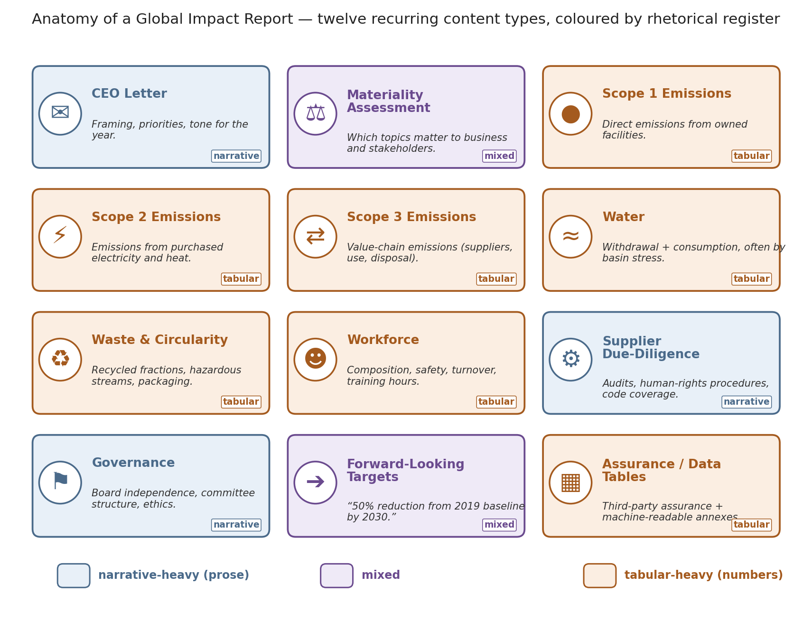

# SUE: Looking Before You Build

**A visual diagnostic study of corporate sustainability report embeddings**

*Elizabeth Orrico. Corpus preview edition — semiconductors subset.*

> This is a Markdown companion to the full paper. The canonical version
> with typeset math, footnotes, and paginated figures is
> [`paper/sue.pdf`](paper/sue.pdf).

## Abstract

We embed 3,685 chunks drawn from 13 publicly-available sustainability,
ESG, and integrated reports (5 companies in the semiconductor equipment
sector) into the 384-dimensional MiniLM sentence-embedding space and
ask a diagnostic rather than a modeling question: *what shape does
this corpus have, and does that shape line up with properties an
author would name for it?*

Our central observation is elementary and generalizable: **when the
content of a document class shifts, the mean embedding of that class
shifts with it, and the displacement between class centroids is itself
an interpretable signal.** In the present corpus, the
financial-disclosure passages of an integrated report and its
narrative ESG passages sit at measurably distinct centroids, and a
single linear direction separates them cleanly (3,447 prose vs. 238
tabular chunks). The same direction accounts for a bimodal
Gaussian-mixture fit (ΔBIC ≈ −10,481 in the top-20 principal-component
subspace) that is invisible to any per-company or per-year partition.

We argue that this *centroid-shift-as-signal* pattern is a
general-purpose diagnostic for text collections whose author-declared
structure ought to imprint on their embedding-space geometry, and we
lay out its mathematical scaffolding (cosine, anisotropy, PCA,
perplexity, BIC, Fisher's ratio) before showing the corpus itself.

---

## 1. Introduction

### 1.1 What a Global Impact Report is

A *Global Impact Report* — variously titled Sustainability Report,
ESG Report, or Integrated Report — is a genre. Any given report will
typically combine, in one PDF running 60 to 200 pages, several
recurring content types: an opening letter from the chief executive,
narrative passages on strategy and stakeholder engagement, and blocks
of tabular financial or operational disclosure. Two rhetorical
registers are placed inside the same document, on the same topics, at
roughly the same publication time. That co-authorship is what makes
the genre uniquely useful for a geometric study.



### 1.2 What is at stake in reading these documents well

Two questions animate the paper. The first is a **disclosure**
question: for any given report, how many of its chunks land on the
numeric side of the corpus and how many on the narrative side? The
second is a **representation** question: when an off-the-shelf
sentence encoder is handed text of this genre, what geometric axis
does it invent to separate the two registers?

Both questions turn out to be the same question in different
vocabularies: *what is inside these documents, and where is the
boundary between what a system claims to represent and what it
actually represents?*

### 1.3 Why look at the vectors before building on top of them

Modern retrieval-augmented systems treat a corpus as a bag of vectors:
each chunk is embedded, indexed, and retrieved by cosine similarity to
a query embedding. The design of such a system is a bet on how the
corpus is shaped in that vector space. When the bet is wrong — for
instance when a corpus that appears homogeneous is in fact bimodal —
retrieval degrades in ways that a downstream evaluator will find hard
to diagnose. **Looking at the vectors first is cheap; looking at them
later is expensive.**

---

## 2. Centroids as a data-story engine *(central thesis)*

**Claim.** Given a text corpus *C* and a partition of its chunks into
content-defined classes *C* = *C*₁ ∪ … ∪ *C*ₖ, the class centroids

$$\mu_j = \frac{1}{|C_j|} \sum_{x \in C_j} E(x) \in \mathbb{R}^{384}$$

are — up to normalization — the smallest sufficient statistic for
recovering the content axis the encoder used to represent the class
distinction. The displacement vector μ*ᵢ* − μ*ⱼ* is an
interpretable direction in embedding space, and its projection onto
every chunk is a per-chunk score along that content axis.

The rest of the paper is one worked instance of the claim: on the
sustainability-report corpus, the two content classes are
"narrative ESG prose" and "tabular financial disclosure," and the
class-centroid axis both separates them cleanly and coincides with the
first nontrivial direction of variation the encoder puts into the
corpus.


---

## 3. Mathematical warm-up

A single section that defines, in order, the objects the rest of the
paper uses:

- **3.1 Embeddings** — a sentence encoder *E* : text → ℝ³⁸⁴, with
  unit-norm outputs living on the sphere.
- **3.2 Cosine similarity** — three interchangeable formulations
  (angle between rays, dot product on unit vectors, standardized
  covariance).
- **3.3 Variance, covariance, and principal components** — PCA as the
  eigendecomposition of the covariance matrix; the top-*k* PCs as the
  best rank-*k* linear approximation of the point cloud.
- **3.4 Anisotropy** — when the cloud has a preferred direction, and
  why isotropic-embedding assumptions distort retrieval.
- **3.5 Entropy, perplexity, and effective neighborhood size** — the
  meaning of the perplexity knob in t-SNE.
- **3.6 The Bayesian Information Criterion** — how to decide whether
  a two-cluster model of the corpus is preferred over a one-cluster
  model.
- **3.7 Fisher's discriminant ratio** — the axis along which two
  labeled classes are maximally separated relative to their internal
  spread.
- **3.8 A note on empirical sampling** — reproducibility conventions
  for every distribution reported later.

Readers already fluent in this material can skim or skip §3.

---

## 4. The corpus

After light PDF text extraction, cleaning, and fixed-size chunking
(approximately 900 characters, 120-character overlap), the corpus
contains **3,685 chunks across 13 reports**. Chunk counts per
company vary from about 250 to about 950 per firm, an imbalance
inherited from publishing conventions rather than curation. Each chunk
is passed through `all-MiniLM-L6-v2`, producing a 384-dimensional
unit-normalized embedding.


---

## 5. Bimodality: the corpus splits, but not by author

A principal-component projection of the whole corpus to two dimensions
shows two features immediately. **First, the colors mix**: the five
companies do not occupy distinguishable regions. Any per-firm
retrieval design that assumed firm-level clustering would be building
on sand. **Second, the cloud is not one lump; there are two visible
modes.**

To promote the visual impression to a measured claim we fit two
Gaussian mixtures — one- and two-component — in the top-20
principal-component subspace (which retains ~50% of corpus variance
and keeps the parameter count tractable). In that subspace
**ΔBIC ≈ −10,481**, a decisive preference for two clusters.


A representative chunk from one cluster reads as narrative ESG prose.
A representative chunk from the other is what PDF-to-text extraction
produces when it walks over a table of financial line items: numbers,
parenthesized signs, whitespace where columns used to be, no verbs.
These are the two class centroids of §2 made concrete: the
unsupervised mixture has discovered the same partition that a
regex-based content labeler produces.

---

## 6. Reading cosine similarity honestly

Cosine similarity is the atom of every retrieval decision. Its
distribution across four pair populations of our corpus tells a
consistent story:

- Same-document pairs average **cos ≈ 0.34**;
- Same-company pairs average **0.34** (essentially coincident with
  same-document);
- Different-company pairs average **0.29**;
- Random pairs average **0.30**.

None of these distributions is centered near zero. Even
different-company pairs cluster near 0.29. That offset is a property
of the encoder, not of our corpus.


### 6.1 Anisotropy

The corpus embedding space has a strong preferred direction: an
anisotropy score of 0.30 (vs. an isotropic baseline of ~0). The first
principal component alone captures ~8% of variance and the top-10 PCs
capture ~37%. This anisotropy is documented in the sentence-embedding
literature (Ethayarajh 2019, Gao et al. 2019) and is the reason
raw cosine similarities look "high" even for unrelated text.


### 6.2 What PCA does and does not see

PCA finds directions of **maximum variance**. It does not
automatically find directions of **maximum class separation**. If two
classes lie on a low-variance axis, PCA will hide them; if they lie on
the highest-variance axis, PCA will reveal them. For this corpus, the
prose-vs-tabular axis is also (approximately) the axis of maximum
variance — which is why the split is visible in 2D projection at all.


---

## 7. Nonlinear projections: t-SNE and UMAP

t-SNE and UMAP are the standard nonlinear alternatives to PCA. The
purpose of showing multiple hyperparameter settings is not to nominate
a winner, but to make the reader aware that every low-dimensional plot
of a corpus is a rendering through a chosen lens. **Across all
settings, the two-lobe structure of §2 and §5 is preserved** — the
class-centroid displacement is robust to the choice of projection,
which is the essential invariance for our claim.


---

## 8. Discussion

The finding is **not** that these five companies write differently
from one another. They write very similarly; at the chunk level our
two-dimensional projections do not resolve company identity. The
finding is that **any single report is itself already a bimodal
object**: it contains a narrative track and a tabular track, and the
geometry of the embedding space picks up on that structure — as a
displacement of class centroids — much more cleanly than it picks up
on authorship.

A retrieval system that treats every chunk as a member of a single
population, and every top-*k* neighborhood as a semantically coherent
context, is likely to **fail differently on the two tracks**. The
prose track will support "what does this company plan to do about
X?" questions; the tabular track will pollute them with
vocabulary-overlapping but intent-mismatched context.

The corresponding design implication: if the two tracks are learnable
from the raw embeddings — §2 shows they are — a downstream system can
route on them. One natural route is separate indices with separate
top-*k* budgets; a lighter one is a single index re-ranked by the
query's projection onto the class-centroid axis.

**Limitations.** (i) Only one industry is represented, so all
industry-level claims remain hypotheses. (ii) Only one embedding
model is used; anisotropy would look different for a model trained
with a stronger uniformity objective. (iii) The content-class label
is regex-based and coarse; a trained classifier might refine it.

None of these limitations undermines the diagnostic claim, which is
elementary: **look at the class centroids of your corpus in embedding
space before you build on top of it.**

---

## 9. Future directions

Five directions follow naturally from the diagnostic:

- **9.1 Chunk-window ablation.** How does the class-centroid axis
  sharpen or blur as chunks lengthen? Prose likely benefits from more
  context; tables become harder to identify as prose leaks in.
- **9.2 Cross-encoder comparison.** Does the class-centroid
  displacement survive an encoder swap (SimCSE, contrastive-decoder
  architectures, or larger models)? A grid of encoders on the same
  corpus would turn a single-encoder diagnostic into a comparative
  statement about representation quality.
- **9.3 Cross-industry expansion.** Adding sectors whose reporting is
  qualitatively different — oil and gas, pharma, consumer banking,
  apparel — would let us ask whether the financial-vs-narrative
  class-centroid axis is universal (a property of the disclosure
  genre) or sector-specific.
- **9.4 Interpretability of the class-centroid direction.** The
  displacement μ_tabular − μ_narrative is itself a 384-dimensional
  vector. Its projection onto known token-level features (digit
  density, punctuation frequency, mean line length, currency-symbol
  presence) would decompose the axis into human-readable components.
- **9.5 Centroid-shift analyses in other document classes.** Any
  corpus whose author-declared structure mixes distinguishable content
  classes into a single stream admits the same diagnostic: scientific
  writing (methods vs. discussion), clinical records (structured
  history vs. free-text notes), legal filings (statutory citation vs.
  argumentation), parliamentary transcripts (speaker centroids),
  research grants (technical vs. rhetorical).

---

## Figures

All figures live in [`paper/figures/`](paper/figures/). A comprehensive
list:

| # | File | Description |
|--|------|-------------|
| 1 | `fig00_report_anatomy.png` | Anatomy of a Global Impact Report |
| 2 | `fig01_corpus_overview.png` | Chunk counts per company |
| 3 | `fig02_pca_2d_by_company.png` | PCA-2D colored by company (colors mix, shape does not) |
| 4 | `fig03_bimodality_gmm.png` | Two-component GMM in top-20 PCA subspace |
| 5 | `fig04_cosine_distributions.png` | Cosine distributions across four pair populations |
| 6 | `fig05_anisotropy.png` | Anisotropy of MiniLM embeddings |
| 7 | `fig06_explained_variance.png` | PCA explained-variance scree |
| 8 | `fig07_whitening.png` | Effect of whitening on the cosine distribution |
| 9 | `fig08_tsne_grid.png` | t-SNE at four perplexity settings |
| 10 | `fig09_umap_grid.png` | UMAP at four n_neighbors settings |
| 11 | `fig10_shepard.png` | Shepard diagram: distance preservation of 2D projections |
| 12 | `fig11_lda_prose_table.png` | Fisher (LDA) axis prose vs. tabular |
| 13 | `fig12_bimodality_on_prosetable.png` | Bimodality along the Fisher axis |
| 14 | `fig13_dendrogram.png` | Hierarchical clustering dendrogram |
| 15 | `fig_anisotropy_intuition.png` | Anisotropy intuition diagram |

---

## Reproducing the figures

Every figure is regenerated from `assets/chunks.parquet` +
`assets/embeddings.npy` (the cached corpus) by:

```bash
python scripts/paper/make_figures.py
```

The full PDF is then assembled with:

```bash
python scripts/paper/build_pdf.py
```

See [README.md](README.md) for the top-level rebuild story.
