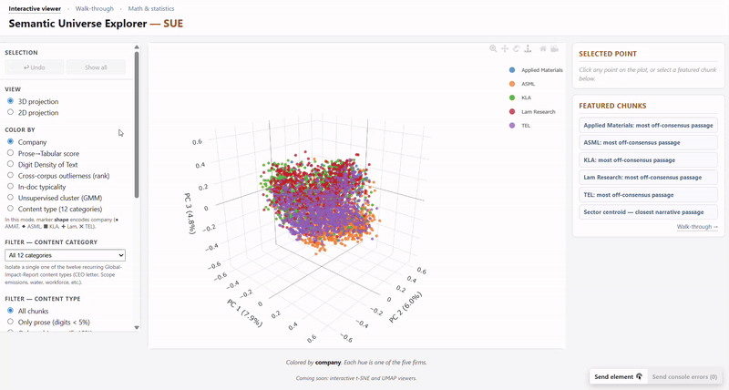
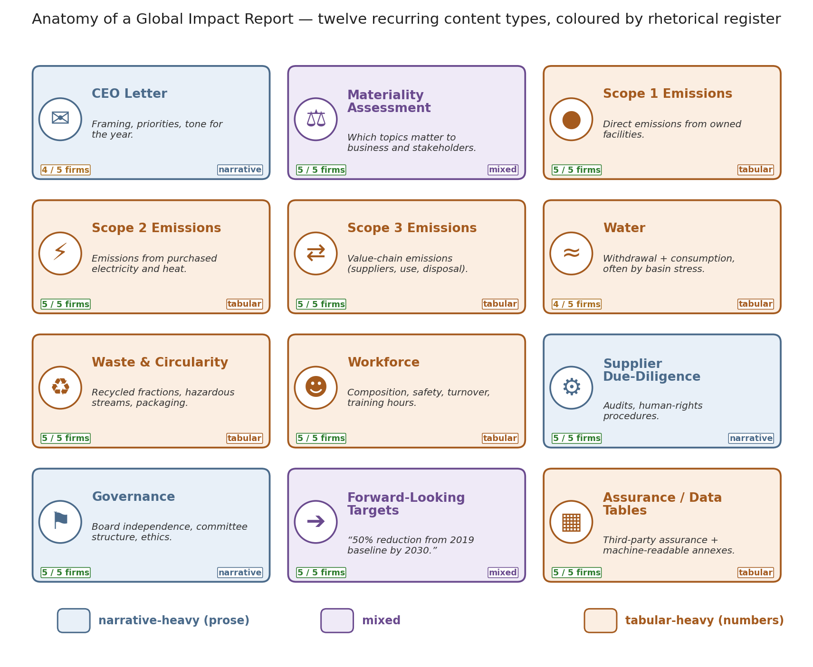

# Semantic Universe Explorer — SUE

**Links**

- **[Interactive viewer](https://emo7bf.github.io/SUE/semantic_universe_explorer.html)** 
- **[Walk-through](https://emo7bf.github.io/SUE/sue_walkthru.html)** 
- **[Math & statistics](https://emo7bf.github.io/SUE/math_and_statistics.html)** 

---

## What is a Global Impact Report?

A **Global Impact Report** (sometimes an ESG or Sustainability Report)
documents a corporation’s environmental, social, and governance
performance — emissions, water, workforce, safety, board oversight,
and supply-chain ethics.

Firms publish them for regulators, capital markets, and the growing pool
of investors who want their portfolios guided by corporate responsibility
as well as by returns.

This demo of the Semantic Universe Explorer (SUE) compares the Global
Impact Reports of five direct competitors in semiconductor-manufacturing
equipment: [Applied Materials](https://www.appliedmaterials.com/content/dam/site/company/csr/doc/2025_impact_report.pdf.coredownload.inline.pdf),
[ASML](https://ourbrand.asml.com/m/71076aaad607de4d/original/asml-2025-annual-report-based-on-us-gaap.pdf),
[KLA](https://www.kla.com/wp-content/uploads/2024-KLA-Global-Impact-Report.pdf),
[Lam Research](https://www.lamresearch.com/wp-content/uploads/2026/05/Lam-Research-2025-Global-Impact-Report.pdf),
and [Tokyo Electron](https://www.tel.com/ir/library/ar/pjsoh100000000rc-att/ir2025_all_en.pdf).

Every dot in the interactive viewer represents one passage —
approximately 900 characters — from one report. Passages are
positioned by semantic similarity rather than by authorship.

## Anatomy of a Global Impact Report

A Global Impact Report is assembled from roughly a dozen recurring
content types. Some are narrative (a CEO letter, a governance chapter,
a description of supplier audits); others are predominantly tabular
(Scope 1 / 2 / 3 emissions, water withdrawal by basin, workforce
demographics). The diagram below labels those blocks and colours them
by rhetorical register — blue for narrative-heavy, orange for
tabular-heavy, purple for mixed. Empirically, the viewer’s
*Prose→Tabular* axis coincides with the same partition.

## What each color mode means

- **Company.** Each chunk is coloured by its authoring firm. Provides
  a visual check for whether any single firm occupies a distinct region
  of the embedding space.
- **Prose→Tabular score.** A scalar per chunk ranging from strongly
  narrative (blue) through mixed (zero) to strongly tabular (red).
  Formally, the projection of the chunk’s embedding onto the axis
  joining the centroid of narrative-labelled chunks to the centroid of
  tabular-labelled chunks.
- **Digit density of text.** A non-learned control variable: the
  fraction of a chunk’s characters that are numerals. Agreement
  between digit density and the Prose→Tabular score suggests the
  separation may reflect surface numeric content rather than learned
  semantics.
- **Cross-corpus outlierness.** For each chunk, the mean distance to
  the centroids of the four other firms’ embeddings. Higher values
  indicate passages atypical of the competitor set.
- **In-doc typicality.** For each chunk, the distance from the centroid
  of its own document.
- **Unsupervised cluster (GMM).** A two-component Gaussian mixture
  fitted on the top-20 principal components without access to any
  prose/tabular label. Recovery of the same partition constitutes
  independent evidence that the split is intrinsic to the corpus.

## Further statistical analyses

The interactive viewer is one entry point to a corpus that also admits
standard statistical treatment. Several complementary methods —
each summarised in **[Math & statistics](https://emo7bf.github.io/SUE/math_and_statistics.html)** with all
variables defined — indicate that the corpus is bimodal along a
prose–tabular axis, and that this partition is preserved under
multiple dimensionality reductions.

- [LDA — the discriminant direction separating narrative from tabular chunks](https://emo7bf.github.io/SUE/math_and_statistics.html#fig11_lda_prose_table)
- [GMM — one- vs. two-component fit on the top principal components](https://emo7bf.github.io/SUE/math_and_statistics.html#fig03_bimodality_gmm)
- [t-SNE at four perplexities](https://emo7bf.github.io/SUE/math_and_statistics.html#fig08_tsne_grid)
- [UMAP at four neighbourhood sizes](https://emo7bf.github.io/SUE/math_and_statistics.html#fig09_umap_grid)

## The five companies and their reports

Each chunk in the viewer corresponds to approximately 900 characters of
one firm’s Global Impact Report. Links to the source documents are
given below.

| Company | 2025 | 2024 | 2023 | 2022 |
|---|---|---|---|---|
| **Applied Materials** | [Impact Report](https://www.appliedmaterials.com/content/dam/site/company/csr/doc/2025_impact_report.pdf.coredownload.inline.pdf) | [Impact Report](https://www.appliedmaterials.com/content/dam/site/company/csr/doc/2024_impact_report.pdf.coredownload.inline.pdf) | [Sustainability Highlights](https://www.appliedmaterials.com/content/dam/site/company/csr/doc/2023_Sustainability_Highlights.pdf.coredownload.inline.pdf)[^1] | [Sustainability Report](https://www.appliedmaterials.com/content/dam/site/company/csr/doc/2022_Sustainability_F.pdf.coredownload.inline.pdf) |
| **ASML** | [Annual Report](https://www.asml.com/en/investors/annual-report/2025) | [Annual Report](https://www.asml.com/en/investors/annual-report/2024) | [Annual Report](https://www.asml.com/en/investors/annual-report/2023) | [Annual Report](https://www.asml.com/en/investors/annual-report/2022) |
| **KLA** | —[^2] | [Global Impact Report](https://www.kla.com/wp-content/uploads/2024-KLA-Global-Impact-Report.pdf) | [Global Impact Report](https://www.kla.com/wp-content/uploads/KLA-Global-Impact-Report-3.pdf) | [Global Impact Report (archived copy)](https://www.responsibilityreports.com/HostedData/ResponsibilityReportArchive/k/NASDAQ_KLAC_2022.pdf)[^3] |
| **Lam Research** | [Global Impact Report](https://www.lamresearch.com/wp-content/uploads/2026/05/Lam-Research-2025-Global-Impact-Report.pdf) | [Global Impact Report](https://www.lamresearch.com/wp-content/uploads/2025/07/Lam-Research-2024-Global-Impact-Report.pdf) | [ESG Report](https://www.lamresearch.com/wp-content/uploads/2024/06/Lam-Research-2023-ESG-Report.pdf) | [ESG Report](https://www.lamresearch.com/wp-content/uploads/2024/06/Lam-Research-2022-ESG-Report.pdf) |
| **Tokyo Electron** | [Integrated Report](https://www.tel.com/ir/library/ar/pjsoh100000000rc-att/ir2025_all_en.pdf) | [Integrated Report](https://www.tel.com/ir/library/ar/egp82m00000000h7-att/ir2024_all_en.pdf) | [Integrated Report](https://www.tel.com/ir/library/ar/f3gfkt000000003v-att/ir2023_all_en_r.pdf) | [Sustainability Report](https://www.tel.com/sustainability/report/index.html)[^4] |

[^1]: Shorter 'Sustainability Highlights' brochure rather than a full report.
[^2]: No 2025 report published yet at time of writing.
[^3]: The 2022 KLA report was pulled from KLA's own site; linked here via the third-party archive at responsibilityreports.com.
[^4]: TEL's 2022 sustainability content was published as a web page rather than a single downloadable PDF.

---

**[Open the walk-through in a more readable view](https://emo7bf.github.io/SUE/sue_walkthru.html)** —
the HTML version renders the math and full-resolution figures that
GitHub’s Markdown viewer does not.
